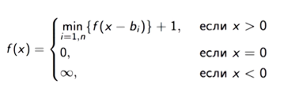

# Dynamic programming

Fundamental properties of all issues that can be solved with dynamic programming is:

 * it is possible boils down issue to graph representation (like for ATM problem)
 * it can be broken down to collection of simpler subproblems
 * it is possible to solve subproblems once and store their solutions (memoization)
 * it is possible to merge solutions of subproblems for solving main problem using recursive relationship (see Bellman equation)

## Known issues

### Coin Change Problem (aka ATM Problem)

Given a set of coins {S1, S2, S3, ..., Si} and amount N. Write an algo­rithm to find out how to make the change of the amount using the minimum size subset of coins.

Bellman equation for this issue:

[JavaScript solution](atm.js) with [tests](atm.spec.js).

## Links

 * [Wikipedia](https://en.wikipedia.org/wiki/Dynamic_programming)
 * [TechnoStream Video Lecture](https://www.youtube.com/watch?v=K3Y1OvATCcs&list=PLrCZzMib1e9pDxHYzmEzMmnMMUK-dz0_7&index=7)
